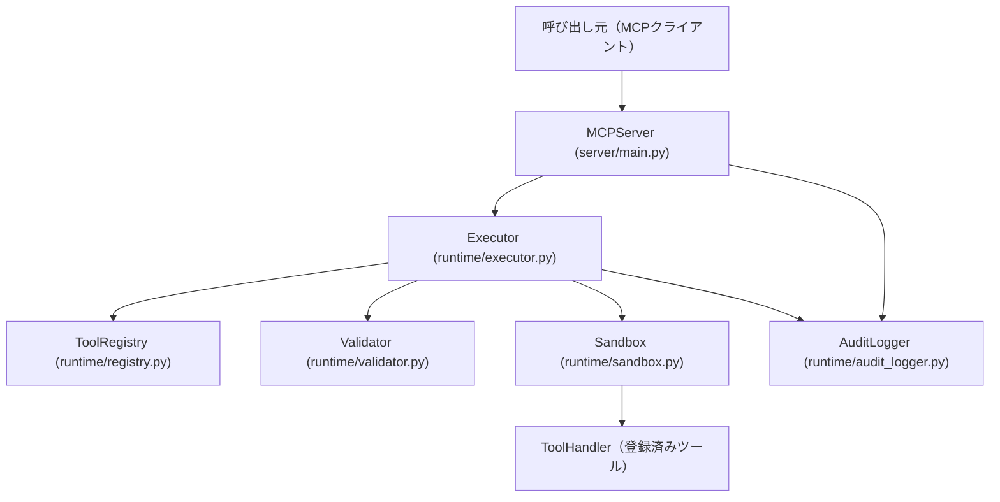

# MCP実行基盤 — docs/mcp

mcp-server-core は、mcp-tools で定義されたツールを安全かつ再現可能に実行するランタイムです。

## アーキテクチャ



## 実行フロー

1. **tool名を受け取る** — `MCPServer.call(tool_name, input_data)` で起動
2. **入力を検証** — `Validator` が JSON Schema に照らして入力を検証
3. **tool定義をロード** — `ToolRegistry` から定義とハンドラを取得
4. **実行** — `Sandbox` 内でタイムアウト付きハンドラ呼び出し
5. **出力を検証** — `Validator` が JSON Schema に照らして出力を検証
6. **ログ記録** — `AuditLogger` が全実行を構造化ログで記録
7. **結果返却** — `ExecutionResult` を返す

## ディレクトリ構成

```
runtime/
├── __init__.py
├── models.py          # データモデル（ToolDefinition, ExecutionResult）
├── registry.py        # ツールレジストリ
├── validator.py       # 入出力バリデータ
├── sandbox.py         # サンドボックス実行コンテキスト
├── executor.py        # 実行パイプライン制御
└── audit_logger.py    # 監査ログ

server/
├── __init__.py
└── main.py            # MCPServer エントリポイント

tests/
├── test_registry.py
├── test_validator.py
├── test_executor.py
└── test_audit_logger.py
```

## 使用方法

```python
from runtime.models import ToolDefinition
from server.main import MCPServer

server = MCPServer()

# ツール登録
definition = ToolDefinition(
    name="greet",
    version="1.0.0",
    description="挨拶を返す",
    input_schema={
        "type": "object",
        "properties": {"name": {"type": "string"}},
        "required": ["name"],
    },
    output_schema={
        "type": "object",
        "properties": {"greeting": {"type": "string"}},
    },
    timeout_seconds=5,
)

def greet_handler(data):
    return {"greeting": f"こんにちは、{data['name']}さん"}

server.register_tool(definition, greet_handler)

# ツール呼び出し
result = server.call("greet", {"name": "世界"})
print(result.output)  # {"greeting": "こんにちは、世界さん"}
```

## 禁止事項

- **任意コマンド実行**: システムコマンドの直接実行は禁止
- **未登録ツール実行**: `ToolRegistry` に登録されていないツールは実行不可
- **入力未検証**: 全入力は JSON Schema で検証する
- **ログなし実行**: 全実行は監査ログに記録する

## セキュリティ原則

- **最小権限**: ハンドラは必要最小限の権限で動作させる
- **入力検証必須**: `validate_input()` を通過しない入力は実行しない
- **出力検証必須**: `validate_output()` を通過しない出力は返さない
- **タイムアウト必須**: `ToolDefinition.timeout_seconds` で上限を設定する
- **Secrets禁止**: ログや出力に機密情報を含めない

## CI 品質ゲート

```bash
python -m pip install -r requirements-dev.txt
black --check .
ruff check .
mypy runtime server
python -m pytest
pip-audit -r requirements.txt
```
